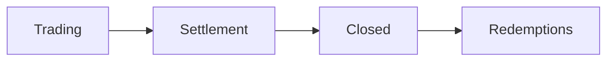

# Fund Completion

How funds are finalized, performance fees calculated, and investors paid out.

---

## Lifecycle Stages at Completion



| Stage | Deposits | Withdrawals | Trading |
|-------|----------|-------------|---------|
| Settlement | ❌ | ❌ | ❌ (only close positions) |
| Closed | ❌ | ✅ | ❌ |

---

## Trading End

When `trading_end_ts` is reached (or `end_trading()` is called):

1. **Stage transitions to Settlement**
2. **No new trades allowed**
3. **Manager must close all positions**
4. **Deposits and withdrawals remain locked**

### Manager Actions During Settlement

During Settlement, the manager can:
- Sell existing positions (convert to USDC)
- Redeem resolved outcome tokens (convert to USDC)

The manager **cannot**:
- Open new positions
- Withdraw funds directly

> **⚠️ Critical**: The fund cannot be finalized until all outcome tokens are converted to USDC.

---

## Finalization

Anyone can call `finalize_close()` when:
- Stage is Settlement
- Vault holds **only USDC** (no outcome tokens)

### What Happens

1. **Final Balance Recorded**
   ```
   final_balance = vault USDC balance
   ```

2. **Profit Calculated**
   ```
   profit = max(0, final_balance - initial_aum)
   ```

3. **Performance Fee Determined**
   ```
   perf_fee = profit * perf_fee_bps / 10_000
   ```

4. **Stage Set to Closed**
5. **Investors can now redeem**

---

## Performance Fee Calculation

### Formula
```
Performance Fee = Profit × Performance Fee Rate

Where:
- Profit = Final Balance - Initial AUM
- Performance Fee Rate = perf_fee_bps / 10,000
```

### Example

| Metric | Value |
|--------|-------|
| Initial AUM | 100,000 USDC |
| Final Balance | 120,000 USDC |
| Profit | 20,000 USDC |
| Performance Fee (20%) | 4,000 USDC |
| Distributable | 116,000 USDC |

### No Profit = No Fee

If `final_balance ≤ initial_aum`:
- Performance fee = 0
- Investors receive full pro-rata share

---

## Fee Distribution

### Automatic Payment

Performance fees are paid **automatically** on the **first redemption** after closure:

1. First investor calls `redeem()`
2. Program checks if `perf_fee_paid == false`
3. If fee is due, transfers to manager fee wallet
4. Sets `perf_fee_paid = true`
5. Continues with investor redemption

### No Manual Claim

The manager does **not** need to claim the fee separately. It's handled atomically with the first redemption.

---

## Investor Withdrawals

Once in the Closed stage, investors can redeem their shares:

### Redemption Formula
```
USDC Received = (shares / total_shares) × distributable_balance

Where:
distributable_balance = vault_usdc_balance (after perf fee)
```

### Example

| Investor | Shares | % of Total | USDC Received |
|----------|--------|------------|---------------|
| Alice | 30,000 | 30% | 34,800 USDC |
| Bob | 50,000 | 50% | 58,000 USDC |
| Charlie | 20,000 | 20% | 23,200 USDC |
| **Total** | 100,000 | 100% | 116,000 USDC |

---

## Post-Completion Analytics

After a fund closes, analytics are preserved:

- **Final Performance**: Overall return percentage
- **Trade History**: All executed trades
- **Position Timeline**: How capital was deployed
- **Fee Summary**: Total collected fees

This data contributes to the manager's **reputation score** for future funds.

---

## Timeline Example

```
Day 0      → Fund Created (Open stage)
Day 7      → Trading Starts (Trading stage)
Day 37     → Trading Ends (Settlement stage)
Day 38     → All positions closed
Day 38     → finalize_close() called (Closed stage)
Day 38+    → Investors redeem shares
```

---

## Next Steps

- [Depositor Guide →](/docs/depositor-guide)
- [Fund Lifecycle Overview →](/docs/fund-lifecycle)
