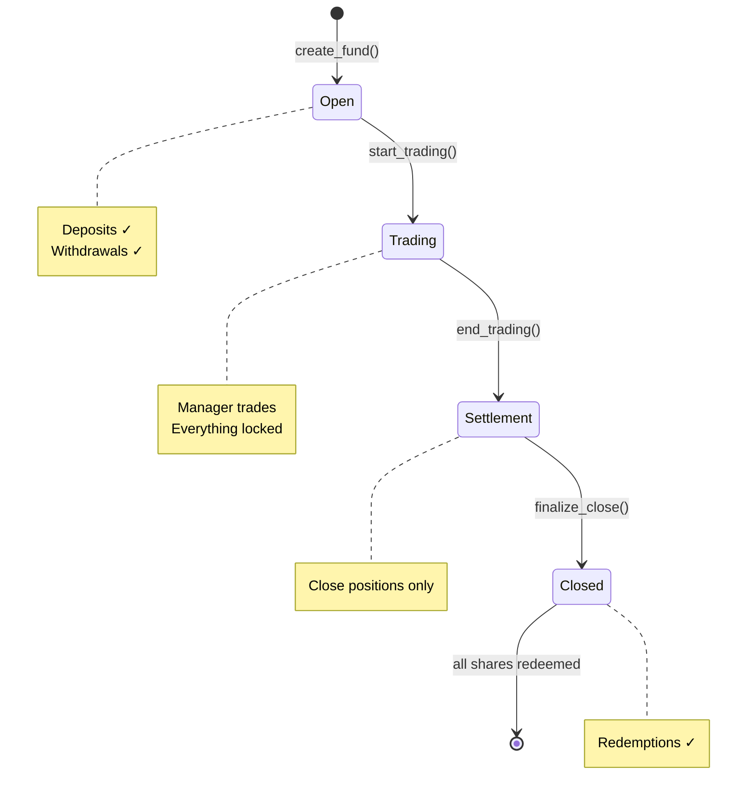

# Fund Lifecycle

Complete reference for fund stages and transitions.

---

## At a Glance

| Stage | Deposits | Withdrawals | Trading | Duration |
|-------|:--------:|:-----------:|:-------:|----------|
| **Open** | ✅ | ✅ | ❌ | Until `trading_start_ts` |
| **Trading** | ❌ | ❌ | ✅ (manager) | Until `trading_end_ts` |
| **Settlement** | ❌ | ❌ | ❌ (close only) | Until finalized |
| **Closed** | ❌ | ✅ | ❌ | Permanent |

---

## Stage Details

### 1. Open Stage

**Purpose**: Accept investor capital before trading begins.

**What can happen**:
- ✅ Investors deposit USDC
- ✅ Investors withdraw (change of mind)
- ✅ Manager receives deposit fees
- ❌ No trading allowed

**Transitions to Trading**:
- Automatically at `trading_start_ts`
- Or when anyone calls `start_trading()`

**On transition**:
- `initial_aum_usdc` is recorded (snapshot)
- No more deposits accepted

---

### 2. Trading Stage

**Purpose**: Manager actively trades the fund.

**What can happen**:
- ✅ Manager executes trades via DFlow
- ✅ Positions opened and closed
- ❌ No deposits (locked)
- ❌ No withdrawals (locked)

**Manager's role**:
- Execute strategy
- Monitor positions
- Manage risk

**Transitions to Settlement**:
- Automatically at `trading_end_ts`
- Or when anyone calls `end_trading()`

---

### 3. Settlement Stage

**Purpose**: Close all positions before finalization.

**What can happen**:
- ✅ Manager closes positions (sell or redeem)
- ❌ No new positions
- ❌ No deposits
- ❌ No withdrawals

**Critical requirement**:
> The vault must hold **only USDC** to proceed.

**Transitions to Closed**:
- When `finalize_close()` is called
- Requires vault holds only USDC

**On transition**:
- Performance fee is calculated
- `perf_fee_due_usdc` is set

---

### 4. Closed Stage

**Purpose**: Distribute funds to investors.

**What can happen**:
- ✅ Investors redeem shares for USDC
- ✅ Performance fee paid (first redemption)
- ❌ No deposits
- ❌ No trading

**Final state**:
- Fund is closed permanently
- Analytics preserved for reputation

---

## Visual Timeline

```
┌─────────────────────────────────────────────────────────────────────┐
│                          FUND TIMELINE                              │
├─────────────────────────────────────────────────────────────────────┤
│                                                                     │
│  OPEN          TRADING              SETTLEMENT    CLOSED            │
│  ─────         ───────              ──────────    ──────            │
│                                                                     │
│  │◄──────────►│◄─────────────────►│◄───────────►│◄─────────        │
│  │            │                    │             │                  │
│  │ Deposits   │ Manager trades     │ Close       │ Redemptions      │
│  │ allowed    │ positions          │ positions   │ allowed          │
│  │            │                    │             │                  │
│  └────────────┴────────────────────┴─────────────┴──────────────    │
│       │                │                  │             │           │
│   Fund        trading_start_ts    trading_end_ts   finalize         │
│   Created                                           _close()        │
│                                                                     │
└─────────────────────────────────────────────────────────────────────┘
```

---

## Stage Transition Instructions

| Transition | Instruction | Who Can Call | Requirement |
|------------|-------------|--------------|-------------|
| Open → Trading | `start_trading()` | Anyone | `now >= trading_start_ts` |
| Trading → Settlement | `end_trading()` | Anyone | `now >= trading_end_ts` |
| Settlement → Closed | `finalize_close()` | Anyone | Vault has only USDC |

---

## Common Scenarios

### Scenario 1: Normal Flow
1. Fund created with 7-day Open, 30-day Trading
2. Investors deposit during Open
3. At day 7, Trading starts automatically
4. Manager trades for 30 days
5. At day 37, Settlement begins
6. Manager closes positions (1-2 days)
7. Fund finalized, investors redeem

### Scenario 2: No Deposits
1. Fund created, but no one deposits
2. Trading starts with 0 AUM
3. Nothing to trade
4. Trading ends, finalize with 0 balance
5. No redemptions needed

### Scenario 3: Extended Settlement
1. Trading ends, but markets not resolved
2. Manager waits in Settlement stage
3. Markets resolve, manager redeems outcome tokens
4. Vault now has only USDC
5. Finalize is called

---

## State Machine



---

## Key Timestamps

| Timestamp | Set At | Purpose |
|-----------|--------|---------|
| `created_at` | Fund creation | Record creation time |
| `trading_start_ts` | Fund creation | When Open ends |
| `trading_end_ts` | Fund creation | When Trading ends |
| `actual_trading_start` | start_trading() | When Trading actually began |
| `finalized_at` | finalize_close() | When fund was closed |

---

## Edge Cases

### What if Trading period is very short?
Manager has limited time to execute strategy. Consider carefully.

### What if manager doesn't close positions?
Fund stays in Settlement indefinitely until positions are closed.

### What if all investors withdraw during Open?
Trading starts with 0 AUM. Fund is effectively empty.

### What if trading_start_ts is in the past?
Anyone can call `start_trading()` immediately.

---

## Summary

The four-stage lifecycle ensures:
- **Investors**: Know exactly when funds are locked
- **Managers**: Have defined trading window
- **Protocol**: Can calculate fees accurately
- **Everyone**: Predictable, transparent process
