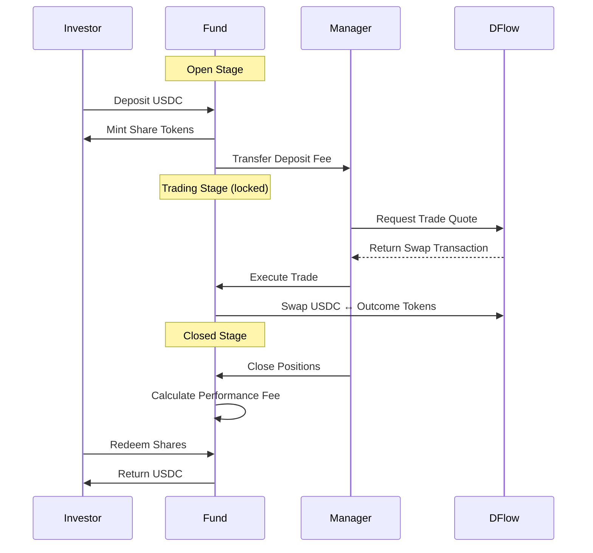

# What is Likeli Funds?

Likeli Funds is a **fully decentralized platform** that enables skilled predictors to manage funds and investors to benefit from their expertise on tokenized prediction markets on Solana via DFlow.

---

## Key Selling Points

### Fully Permissionless
Anyone can start or invest in a prediction fund. No gatekeepers, no approval process—just connect your Solana wallet and get started.

### Profit Sharing
Expert predictors can specify a performance fee for their management. Earn a share of profits when your strategy succeeds.

### Fund Isolation
Managers are **only allowed to trade** in prediction markets with deposited funds. They cannot withdraw investor capital directly—only investors can redeem their shares.

### Built on DFlow
Likeli Funds leverages DFlow's tokenized prediction market infrastructure:
- **Market Discovery**: Access Kalshi markets tokenized on Solana
- **Best Execution**: DFlow routes orders for optimal pricing
- **On-chain Settlement**: All positions held as SPL tokens

---

## Quick Navigation

| Section | Description |
|---------|-------------|
| [Predictor Guide](/docs/predictor-guide) | Create and manage a prediction fund |
| [Depositor Guide](/docs/depositor-guide) | Invest in funds and redeem shares |
| [Fund Lifecycle](/docs/fund-lifecycle) | Understand stages and transitions |
| [Making Predictions](/docs/making-predictions) | Execute trades on DFlow markets |

---

## Terms & Definitions

| Term | Definition |
|------|------------|
| **Predictor / Manager** | The wallet that creates and manages a fund. Executes trades during the Trading stage. |
| **Investor / Depositor** | Any wallet that deposits USDC into a fund in exchange for shares. |
| **Prediction Fund** | A Solana program account (PDA) that holds investor capital and executes trades on their behalf. |
| **Outcome SPL Tokens** | YES/NO tokens representing positions in prediction markets. SPL tokens on Solana. |
| **Fund Contract** | The Likeli Fund Solana program account plus associated vault ATAs. |
| **Deposit Fee** | A fee (max 3%) charged on deposits, transferred immediately to the manager. |
| **Performance Fee** | A fee (max 30%) charged only on profits, calculated at fund closure. |
| **AUM Snapshot** | The initial Assets Under Management recorded when trading begins. |
| **Share Tokens** | SPL tokens representing proportional ownership of a fund. |

---

## How It Works

---

## Next Steps

Ready to get started?

- **Managers**: [Create Your First Fund →](/docs/predictor-guide)
- **Investors**: [Find a Fund to Invest In →](/docs/depositor-guide)
